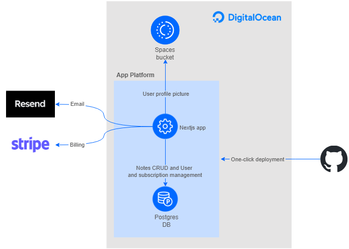

# Digital Ocean SaaS Starter Kit

The DigitalOcean SaaS Starter Kit is designed to show developers how easy it is to build and
deploy a SaaS app using DigitalOcean services. It includes essential features—authentication,
billing, API management, and user roles—so developers can skip setup and focus on building
their product.

## Table of Contents

- [Goals](#goals)
- [Architecture diagram](#architecture-diagram)
- [Getting Started](#getting-started)
- [Requirements](#requirements)
- [Deploy the app](#deploy-the-app)
- [License](#license)

## Goals

The goal isn’t to dictate what kind of SaaS app to build. Instead, this kit provides a solid
foundation that can be extended in any direction.

## Architecture diagram

## Getting Started

This guide describes how to use DigitalOcean App Platform to run a sample Next.js application.

**Note**: Following these steps may result in charges for the use of DigitalOcean services.

### Requirements

- You need a DigitalOcean account. If you do not already have one, first [sign up](https://cloud.digitalocean.com/registrations/new).

## Deploy the App

Click the following button to deploy the app to App Platform. If you are not currently logged in with your DigitalOcean account, this button prompts you to log in.

Note that, for the purposes of this tutorial, this button deploys the app directly from DigitalOcean's GitHub repository, which disables automatic redeployment since you cannot change our template. If you want automatic redeployment or you want to change the sample app's code to your own, we instead recommend you fork [our repository](https://github.com/ajot/do-starter-kit/tree/main).

To fork our repository, click the **Fork** button in the top-right of [its page on GitHub](https://github.com/ajot/do-starter-kit/tree/main), then follow the on-screen instructions. To learn more about forking repos, see the [GitHub documentation](https://docs.github.com/en/github/getting-started-with-github/fork-a-repo).

If you want to use the one click deploy button from your forked repo, follow these steps:

- After forking the repo, you need to replace the value of the `repo_clone_url` with your own forked repo url in the `deploy.template.yaml` file located in the `.do` directory.
- Here in the Readme, replace the repo URL in the button URL.

Otherwise, to deploy the new forked repo manually, visit the [control panel](https://cloud.digitalocean.com/apps) and click the **Create App** button. This takes you to the app creation page. Under **Service Provider**, select **GitHub**. Then, under **Repository**, select your newly-forked repo. Ensure that your branch is set to **main**. Finally, click **Next** and configure the rest of the deployment.

## License

This repo is covered under [The MIT License](LICENSE).
