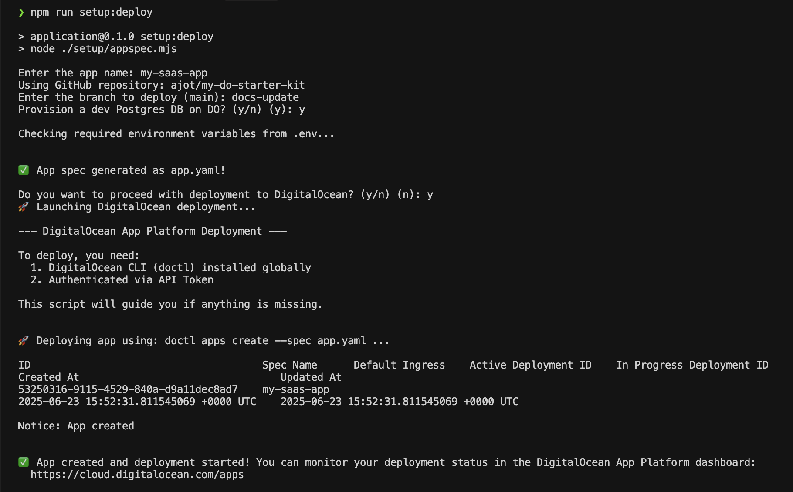

# DigitalOcean Deployment Guide

This guide walks you through deploying your SaaS Starter Kit to DigitalOcean's App Platform, which provides a fully managed platform for hosting web applications.

## Prerequisites

Before you begin, make sure you have:

- A [DigitalOcean account](https://cloud.digitalocean.com/registrations/new)
- Your SaaS Starter Kit application code with any customizations you've made
- A GitHub repository containing your code (either a fork of the original repo or your own)
- [Stripe setup](./stripe-integration-guide.md) completed (if using billing features)
- [Resend setup](../README.md#part-2-set-up-email-provider-resend) completed (if using email features)
- [Spaces setup](../README.md#part-3-set-up-file-storage-digitalocean-spaces) completed (if using file storage)

## Deployment Steps

### Step 1: Install and Configure `doctl`

1. **Download and install the DigitalOcean CLI tool**:

   - Visit the [doctl installation page](https://docs.digitalocean.com/reference/doctl/how-to/install/)
   - Follow the instructions for your operating system

2. **Create an API key**:

   - Log in to your [DigitalOcean account](https://cloud.digitalocean.com/)
   - Go to **API** in the left sidebar
   - Click **Generate New Token**
   - Give it a name (e.g., "SaaS Deployment")
   - Ensure both read and write scopes are selected
   - Click **Generate Token**
   - Copy and store the token securely (you won't be able to see it again)

3. **Authenticate with doctl**:
   ```bash
   doctl auth init
   ```
   - Paste your API token when prompted

### Step 2: Create a GitHub Repository

DigitalOcean App Platform requires a GitHub repository to deploy from. If you don't already have your code in a GitHub repository, create one:

```bash
git remote remove origin
gh repo create GITHUB_REPO_NAME --public --source=. --remote=origin --push
```

Replace `GITHUB_REPO_NAME` with your desired repository name (e.g., `my-saas-app`).

### Step 3: Generate Your App Spec and Deploy

The App Spec is a YAML file that defines how your application should be deployed on DigitalOcean's App Platform.

1. **Run the deployment setup script**:

   ```bash
   cd application
   npm run setup:deploy
   ```

   This interactive script will guide you through the deployment process and automatically generate the `app.yaml` file for you. You'll be asked a few questions:

   ```
   Enter the app name: my-saas-app
   Using GitHub repository: your-username/your-repo-name
   Enter the branch to deploy (main): main
   Provision a dev Postgres DB on DO? (y/n) (y): y

   Checking required environment variables from .env...

   ✅ App spec generated as app.yaml!

   Do you want to proceed with deployment to DigitalOcean? (y/n) (n): y
   🚀 Launching DigitalOcean deployment...
   ```

   - **App name**: Choose a name for your application (e.g., `my-saas-app`)
   - **GitHub repository**: The script will detect your connected GitHub repository
   - **Branch to deploy**: Specify which branch to deploy (defaults to `main`)
   - **Postgres DB**: Choose whether to provision a development PostgreSQL database on DigitalOcean
   - **Proceed with deployment**: If you answer "y", the script will immediately deploy your app



2. **Review the generated `app.yaml` file** (created in your project root)

> **Note:** The script automatically transfers settings from your `.env` file to the app spec, including:
>
> - `APP_NAME`: Name for your app in DigitalOcean
> - `SPACES_KEY_ID`, `SPACES_SECRET_KEY`, `SPACES_BUCKET_NAME`, `SPACES_REGION`: Your Spaces storage configuration
> - `AUTH_SECRET`: Secret string for Auth.js
> - `RESEND_API_KEY`, `RESEND_EMAIL_SENDER`: Your email service configuration
> - `STRIPE_SECRET_KEY`, `STRIPE_WEBHOOK_SECRET`, `STRIPE_FREE_PRICE_ID`, `STRIPE_PRO_PRICE_ID`, `STRIPE_PRO_GIFT_PRICE_ID`, `STRIPE_PORTAL_CONFIG_ID`: Your Stripe configuration
> - `BASE_URL`: Will be set after deployment (used for callbacks)

### Step 4: For Subsequent Deployments

After your initial deployment, you can use the following command to deploy updates to your application:

1. **Run the deployment script**:

   ```bash
   npm run deploy
   ```

   This script will:

   - Verify that `doctl` is installed and authenticated
   - Update your app using the existing `app.yaml` (or create a new one if needed)
   - Run any pending database migrations
   - Show deployment progress in your terminal

2. **Wait for deployment to complete**:
   - The deployment may take 3-5 minutes
   - You'll see progress updates in your terminal

### Step 5: Configure Your Deployed Application

1. **Set the `BASE_URL` environment variable**:

   - After deployment completes, note the URL of your deployed app (e.g., `https://your-app-name.ondigitalocean.app`)
   - Go to your app in the [DigitalOcean App Platform](https://cloud.digitalocean.com/apps)
   - Click on your app → Settings → Environment Variables
   - Add or update the `BASE_URL` variable with your app's URL
   - Click Save and wait for the app to redeploy

2. **Configure Stripe webhooks** (if using Stripe):
   - Follow the [Stripe webhook setup instructions](./stripe-integration-guide.md#option-a-production-webhook-setup-deployed-app) using your new app URL

## Best Practices for Secrets and Environment Variables

### Never Commit Secrets to Version Control

- Add `.env`, `.env.*`, and any secret files to your `.gitignore`
- Use example files (like `env-example`) to show required variables without real values
- Consider using a secrets management tool for team environments

### Encrypt Secrets at Rest and in Transit

- Ensure secrets are encrypted wherever they are stored and when transmitted
- Check the **Encrypt** checkbox for sensitive values in DigitalOcean environment variables configuration
- Use HTTPS for all communications with your app

### Perform Regular Secret Maintenance

- Expire or revoke unused access tokens
- Rotate secrets periodically (every 30-90 days)
- Remove whitelisted IPs when no longer needed
- Audit your secrets access regularly

## Troubleshooting

### Deployment Failures

- Check the deployment logs in the DigitalOcean dashboard
- Verify that all required environment variables are set
- Ensure your GitHub repository is accessible to DigitalOcean

### Database Connection Issues

- Verify that your database connection string is correct
- Check that your database is accessible from the App Platform (may require adjusting trusted sources)

### Missing Environment Variables

- Double-check that all required variables from your `.env` file were transferred to the app spec
- Manually add any missing variables in the DigitalOcean App Platform dashboard

## Next Steps

After successful deployment:

- Set up a custom domain for your application
- Configure SSL/TLS certificates (automatic with App Platform)
- Set up monitoring and alerts
- Consider implementing a CI/CD pipeline for automated deployments

For more information, see the [DigitalOcean App Platform documentation](https://docs.digitalocean.com/products/app-platform/).
