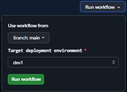

# GitHub Workflows Overview

This document describes the continuous integration and development deployment workflows configured in this repository using GitHub Actions. The workflows ensure code quality, enforce consistency, and automate the deployment of the application to DigitalOcean App Platform.

---

## 🧪 `.github/workflows/ci.yml` — Continuous Integration

### Purpose

This workflow validates the application code on every push or pull request targeting the `main` branch. It ensures that the codebase adheres to linting standards, passes all tests, and builds successfully.

### Triggers

- Pushes to `main` affecting files under `application/**`
- Pull requests targeting `main` that modify `application/**`
- Manual trigger via `workflow_dispatch`
- Called by other workflows via `workflow_call`

### Job: `lint-and-build`

Runs on: `ubuntu-latest`

Steps:

1. **Checkout Code** — Clones the repository.
2. **Setup Node.js** — Installs Node.js 20 and caches dependencies using `package-lock.json`.
3. **Install Dependencies** — Installs packages using `npm ci`.
4. **Lint** — Runs static code analysis via `npm run lint`.
5. **Client-side Tests** — Executes unit tests for the client side with `npm run test`.
6. **Server-side Tests** — Executes unit tests for server logic using `npm run test:server`.
7. **Build** — Builds the application with `npm run build`.

> ✅ This workflow ensures your application remains reliable and consistent before any deployment.

---

## 🚀 `.github/workflows/deploy.yml` — Deployment

### Purpose

This workflow performs an automated deployment to the DigitalOcean App Platform based on environment-specific configurations.

### Triggers

- Manual trigger via `workflow_dispatch` with development environment selection

### Input Parameters

| Name          | Description                   | Default | Options        |
| ------------- | ----------------------------- | ------- | -------------- |
| `environment` | Target deployment environment | `dev1`  | `dev1`, `dev2` |

### Workflow Structure

#### 1. Job: `ci`

Calls the CI workflow (`ci.yml`) to lint, test, and build the application before deployment.

#### 2. Job: `deploy`

Runs on: `ubuntu-latest`  
Environment: dynamically set via input (`dev1`, or `dev2`)

##### Steps:

1. **Checkout Code** — Clones the repository at the appropriate ref or defaults to `main`.
2. **Export Secrets and Vars** — Dynamically injects all GitHub Environment variables and secrets using `toJson()` and `jq`:
   - Reads `vars` and `secrets` from the selected environment.
   - Writes them to `$GITHUB_ENV` for use in subsequent steps.
3. **Add Metadata Variables** — Appends application-level environment variables like `APP_NAME`, `DB_NAME`, and `CLUSTER_NAME` based on the environment.
4. **Generate Deployment Spec** — Uses `envsubst` to replace template variables in `.do/app.template.yaml` and generate `.do/app.yaml`.
5. **Deploy to DigitalOcean** — Uses the `digitalocean/app_action/deploy@v2` action to trigger deployment with the generated spec.

> ⚠️ Ensure the selected GitHub Environment has all required `secrets` and `vars` configured.

---

## 📌 Notes

- All workflows rely on `ubuntu-latest` runners and require Node.js 20.
- You should maintain the list of environment variables and secrets in the GitHub UI under **Settings > Environments** for each environment (`dev1`, `dev2`) or global repository variables/secrets.
- No variables are hardcoded in the workflow YAMLs; they are injected dynamically from the environment, allowing easier maintenance and environment-specific behavior.

---

## ✅ Best Practices

- Keep `.do/app.template.yaml` up to date with all required variables.
- Use the GitHub Environments UI to define secrets/vars to avoid exposing sensitive data.
- Run the deployment manually through [GitHub Actions Page](https://github.com/ajot/do-starter-kit/actions/workflows/deploy.yml):



- Run the deployment manually using GitHub CLI running:

```bash
gh workflow run "Deploy" --ref main -f environment=dev1
```

---
